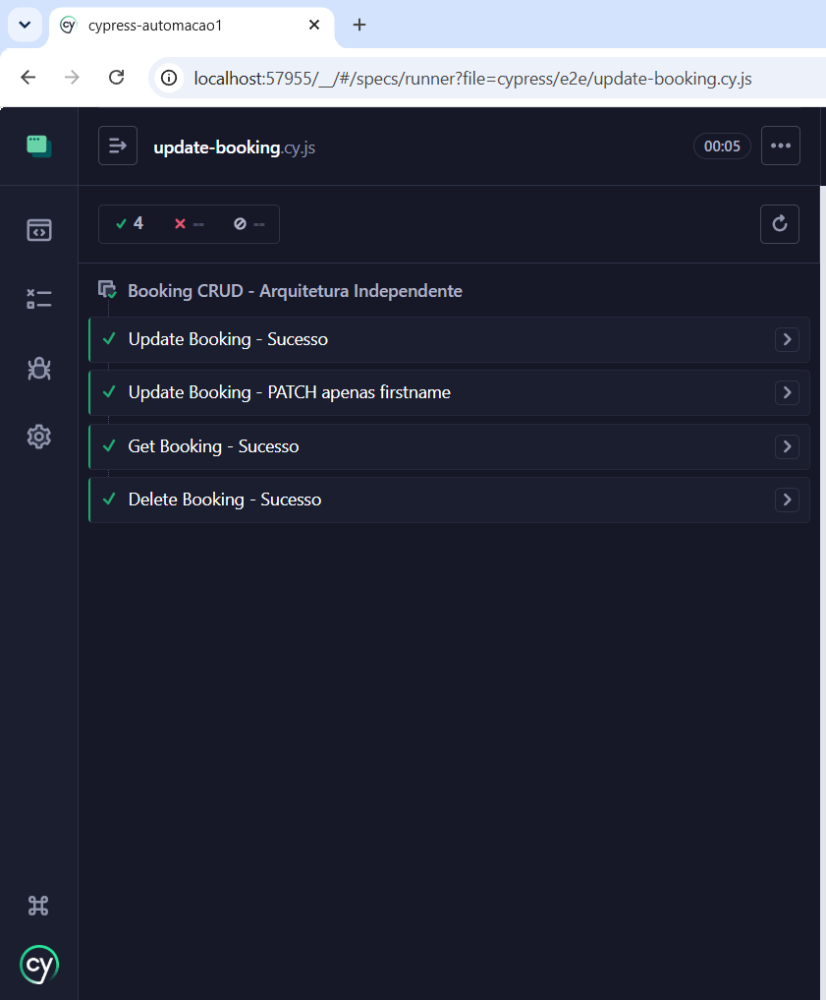
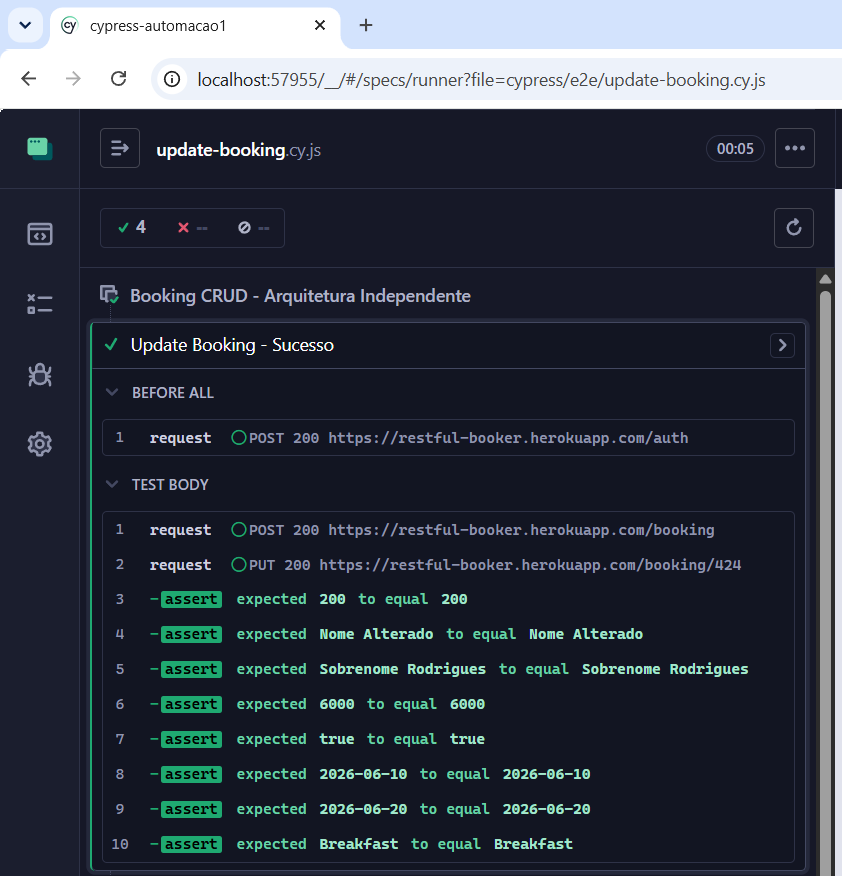
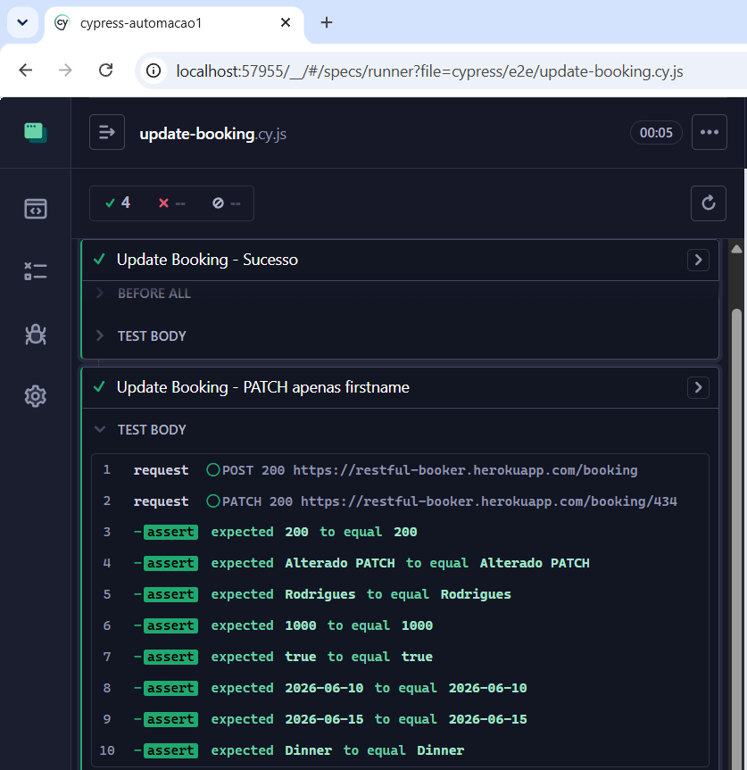
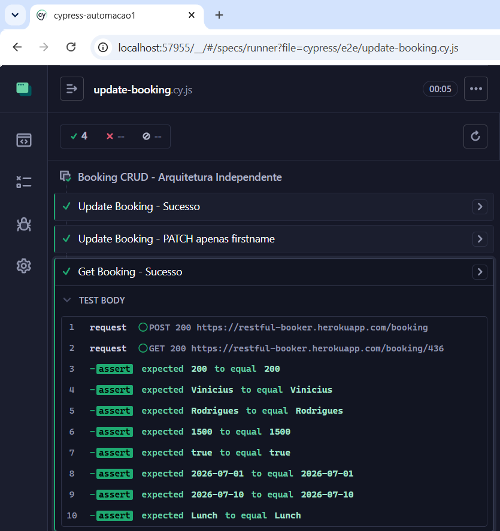
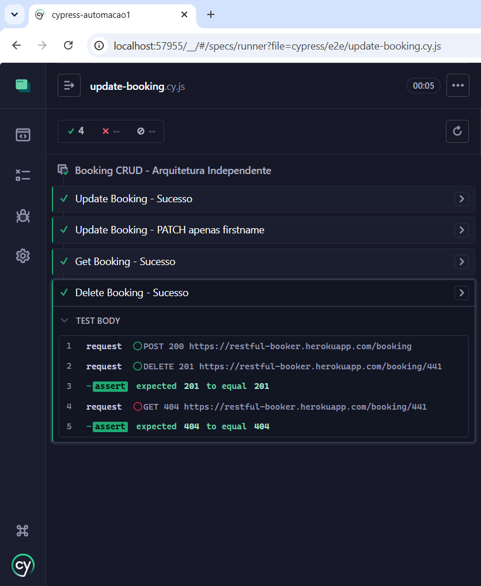

# 📌 Cypress Booking CRUD API Tests

[](https://www.cypress.io/)
[](https://nodejs.org/)
[](https://restful-booker.herokuapp.com/)

Projeto focado em automação de testes de API, demonstrando a implementação de um ciclo completo de **CRUD** (Create, Read, Update, Delete) utilizando **Cypress**.  
O objetivo é garantir a qualidade e a integridade de dados na API [Restful Booker](https://restful-booker.herokuapp.com), validando cenários de sucesso e comportamento esperado.

---

## 🛠️ Tecnologias Utilizadas
- **Cypress** → Framework principal para automação  
- **Node.js** → Ambiente de execução  
- **JavaScript** → Linguagem utilizada para escrita dos testes  

---

## 🎯 Objetivo e Diferenciais
Este projeto foi desenvolvido para demonstrar proficiência em:
- **Automação de API** → validação de *Status Codes* e *Responses*  
- **Arquitetura Independente** → cada teste cria seus próprios dados  
- **Validação Completa** → cobertura de ponta a ponta do ciclo de vida da reserva  
- **Boas Práticas** → código limpo, organizado e fácil de manter  

---

## 🚀 Como rodar o projeto

### Pré-requisitos
- Ter o [Node.js](https://nodejs.org/) instalado  
- Clonar este repositório

### Instalação
```bash
npm install
```
```bash
npx cypress open
```
```bash
npx cypress run
```
```
📂 Estrutura do Projeto
cypress-automacao1/
│
├── cypress/
│   ├── e2e/               # Arquivos de teste (update-booking.cy.js)
│   ├── fixtures/          # Massa de dados
│   └── support/           # Comandos customizados
├── assets/                # Imagens de demonstração (prints dos testes)
├── cypress.config.js      # Configurações do Cypress
├── package.json           # Dependências
└── README.md              # Documentação
```

### 📸 Demonstração de Testes

O que você verá ao rodar os testes:

### Visão Geral da Suíte → todos os cenários passando com ✅

### Create Booking → criação de uma nova reserva

### Read Booking (GET) → leitura e validação dos dados criados

### Update Booking (PUT/PATCH) → atualização completa e parcial

### Delete Booking → exclusão e confirmação que não existe mais







